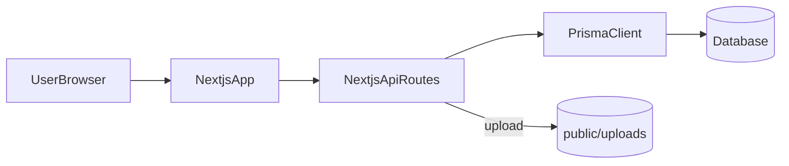

## サンホーム 営業統合管理システム 仕様書

本書は、`sanhome-sales/` 配下の現行実装（Next.js + NextAuth + Prisma）を読み取り、**機能・データ・API・権限・運用**を網羅的に整理した仕様書である。

### 目次
- [1. 概要](#1-概要)
- [2. システム全体像](#2-システム全体像)
- [3. 機能一覧（ユースケース）](#3-機能一覧ユースケース)
- [4. 画面一覧・遷移](#4-画面一覧遷移)
- [5. データ設計（DB）](#5-データ設計db)
- [6. API仕様（概要）](#6-api仕様概要)
- [7. 認証・認可（権限）](#7-認証認可権限)
- [8. ファイル/アップロード仕様](#8-ファイルアップロード仕様)
- [9. 外部サービス](#9-外部サービス)
- [10. 運用・環境構築](#10-運用環境構築)
- [11. 既知のギャップ/要決定事項](#11-既知のギャップ要決定事項)

### 付録（詳細）
- **画面仕様**: [`spec/screens.md`](spec/screens.md)
- **API仕様（詳細）**: [`spec/api.md`](spec/api.md)
- **DB仕様（詳細）**: [`spec/db.md`](spec/db.md)
- **運用/環境（詳細）**: [`spec/ops.md`](spec/ops.md)
- **ギャップ/要決定事項（詳細）**: [`spec/gaps.md`](spec/gaps.md)

---

## 1. 概要

### 1.1 目的
営業担当者の **売上・経費・スケジュール** を一元管理し、担当者/期間別の集計・参照を行う。

### 1.2 対象範囲
- **対象**: 画面（App Router）、API（Route Handlers）、DB（Prisma schema）、画像アップロード
- **非対象**: 外部会計連携、承認ワークフロー、メール通知、監査ログの本格実装（現状コードに明示なし）

### 1.3 用語
- **営業**: `User.role = "sales"`
- **管理者**: `User.role = "admin"`
- **登録者**: `Sale.userId`（売上データの作成者）
- **担当者（複数）**: `Sale.assignees`（粗利配分の対象者）
- **粗利配分**: `Sale.profitRatios`（JSON文字列、担当者ごとの比率）

---

## 2. システム全体像

### 2.1 技術構成
- **Web**: Next.js（App Router）
- **本番デプロイ**: **Vercel** を想定（ホスティング・CI/CD・環境変数）
- **認証**: NextAuth v5（Credentials、JWTセッション）
- **DBアクセス**: Prisma Client
- **DB**: **PostgreSQL**（`DATABASE_URL`）。ローカルも Vercel も同じ Prisma マイグレーションを適用する。

### 2.2 構成図

### 2.3 データフロー（代表）
- **ログイン**: `login`画面 → NextAuth(Credentials) → JWT発行 → `SessionProvider` でクライアント参照
- **経費登録（画像あり）**: 画面→`/api/upload`→`public/uploads` 保存→URLを `Expense.receiptImageUrl` に保存
- **売上登録（複数担当）**: 画面→`/api/sales(POST)`→ `Sale` 作成 + `assignees` 接続 + `profitRatios` 保存
- **スケジュール表示**: 画面→`/api/schedules(GET)`（期間指定）→ 週/日表示へ反映

---

## 3. 機能一覧（ユースケース）

- **ログイン/ログアウト**
  - メールアドレス+パスワードによるログイン
  - ログアウト
- **ダッシュボード**
  - 期間（年/月）・担当者を切替して、売上/粗利/経費を集計表示
  - 当日のスケジュール一覧
- **売上管理**
  - 売上の登録/削除
  - 半期（4-9月 / 10-3月）の自動集計
  - 選択期間の一覧表示、未決済のみ表示
  - 複数担当者、粗利配分（担当者別の粗利按分）に対応
  - 決済日、決済状況（手動トグル）
  - CSV等による一括取り込み（APIのみ）
- **経費精算**
  - 月別の経費一覧/合計
  - 領収書画像アップロード（任意）
  - 自分の経費の削除（APIが所有者チェック）
- **スケジュール**
  - 週表示（全員/個人）・日表示（グループ）
  - 予定の登録/編集/削除（APIが所有者チェック）
- **設定（管理者向け）**
  - グループ作成/削除、ユーザー所属設定
  - ユーザー作成
  - ユーザー詳細画面でパスワード変更

---

## 4. 画面一覧・遷移

画面一覧/項目詳細は付録の [`spec/screens.md`](spec/screens.md) を参照。

### 4.1 ルーティング概要
- `/` → `/login` にリダイレクト（`src/app/page.tsx`）
- 公開ページ: `/login`
- アプリ領域: `/dashboard`, `/sales`, `/expenses`, `/schedule`, `/settings`, `/users/:id`

---

## 5. データ設計（DB）

DB詳細は付録の [`spec/db.md`](spec/db.md) を参照。

### 5.1 主なエンティティ
- `users`: ユーザー（権限/所属グループ）
- `groups`: グループ
- `sales`: 売上（登録者、複数担当、粗利配分、決済）
- `expenses`: 経費（領収書URL）
- `schedules`: スケジュール
- `_SaleAssignees`: 売上↔担当者の中間テーブル（Prisma多対多）

---

## 6. API仕様（概要）

詳細は付録の [`spec/api.md`](spec/api.md) を参照。

### 6.1 一覧（概要）
- **認証**: `/api/auth/[...nextauth]`
- **ユーザー**: `/api/users`, `/api/users/:id`
- **グループ**: `/api/groups`, `/api/groups/:id`
- **売上**: `/api/sales`, `/api/sales/:id`, `/api/sales/import`
- **経費**: `/api/expenses`, `/api/expenses/:id`
- **予定**: `/api/schedules`, `/api/schedules/:id`
- **アップロード**: `/api/upload`
- **ダッシュボード集計**: `/api/dashboard/summary`

---

## 7. 認証・認可（権限）

### 7.1 認証（NextAuth）
- **方式**: Credentials（メール/パスワード）
- **セッション**: JWT
- **JWTに格納**: `id`, `role`

### 7.2 認可（現状の実装傾向）
- **画面（ナビ）**: `設定` は管理者のみ表示（`Navigation.tsx`）
- **API**:
  - `expenses/:id`, `schedules/:id` は所有者チェックあり（`userId` で照合）
  - `users`, `groups`, `sales` 系は**ロール/所有者チェックが実装されていない**（仕様としては要検討）

---

## 8. ファイル/アップロード仕様

- **保存先（現状・ローカル向け）**: `public/uploads/`
- **Vercel 本番**: サーバーレス実行でローカル書き込みは永続化されない。**オブジェクトストレージ**（例: Vercel Blob、S3 互換）などへの移行が必要。
- **保存名**: `timestamp-rand.ext`
- **返却URL**: `/uploads/<filename>`
- **制限**: 現状は拡張子/サイズ上限・ウイルスチェック等が明示されていない（「既知ギャップ」に記載）

---

## 9. 外部サービス

- **ホスティング**: Vercel（想定）
- **DB**: Neon 等のマネージド PostgreSQL（接続文字列を環境変数で指定）
- **ファイル**: 本番では Vercel Blob（`BLOB_READ_WRITE_TOKEN`）を想定
- **レシートの AI 読み取り（OCR）**は提供しない。領収書は画像として保存し、金額等は手入力する。

---

## 10. 運用・環境構築

詳細は付録の [`spec/ops.md`](spec/ops.md) を参照。本番は **Vercel**（同付録「本番（Vercel）」）。

---

## 11. 既知のギャップ/要決定事項

詳細は付録の [`spec/gaps.md`](spec/gaps.md) に記載する。ここでは特に影響が大きい事項を列挙する。

- **APIの権限制御不足**
  - 特に `users/groups/sales` 系は、認可（管理者のみ/本人のみ等）の仕様決定と実装反映が必要。
- **アップロードのセキュリティ**
  - MIME/拡張子/サイズ制限、公開範囲、削除、スキャン等の要件が未確定。

