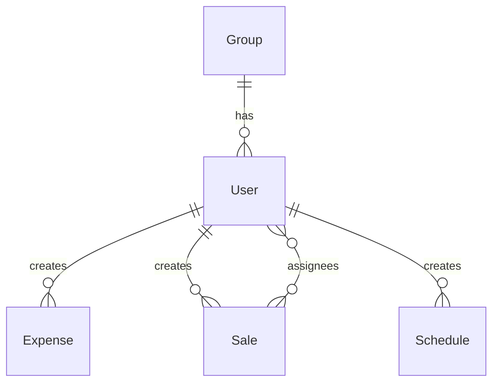

## DB仕様（Database）

参照実装:
- Prisma schema: `sanhome-sales/prisma/schema.prisma`
- Migrations: `sanhome-sales/prisma/migrations/*/migration.sql`

重要:
- 本書は **Prisma schema を正** として整理しつつ、migrations との差分は「ギャップ」として明示する。

---

## 1. DB方式
- **Prisma datasource**: `provider = "postgresql"`
- **接続**: `DATABASE_URL`（例: Neon / Supabase / ローカル Docker Postgres）

---

## 2. ER（概念）

---

## 3. テーブル定義（Prismaモデル）

### 3.1 `groups`（`model Group`）
- **PK**: `id`（uuid）
- **Columns**:
  - `name`: string
  - `created_at`: datetime（default now）
- **Relations**:
  - `users`: `User[]`

### 3.2 `users`（`model User`）
- **PK**: `id`（uuid）
- **Unique**: `email`
- **Columns**:
  - `name`: string
  - `email`: string
  - `password`: string（bcrypt hash を保存する想定）
  - `role`: string（`"sales"` / `"admin"`）
  - `group_id`: nullable
  - `created_at`: datetime（default now）
- **Relations**:
  - `group`: `Group?`（`group_id`）
  - `expenses`: `Expense[]`
  - `sales`: `Sale[]`（登録者）
  - `assignedSales`: `Sale[]`（多対多: 担当者）
  - `schedules`: `Schedule[]`

### 3.3 `expenses`（`model Expense`）
- **PK**: `id`（uuid）
- **FK**: `user_id` → `users.id`（onDelete: Cascade）
- **Columns**:
  - `date`: datetime
  - `category`: string
  - `amount`: int
  - `receipt_image_url`: nullable string
  - `memo`: nullable string
  - `created_at`: datetime（default now）

### 3.4 `sales`（`model Sale`）
- **PK**: `id`（uuid）
- **FK**: `user_id` → `users.id`（onDelete: Cascade）
- **Columns**:
  - `date`: datetime（契約日）
  - `project_name`: string
  - `category`: string（例: `いい部屋ネット` / `仲介` / `事業利益`）
  - `sales_amount`: int
  - `gross_profit`: int
  - `settlement_date`: datetime（決済日、default now）
  - `is_settled`: boolean（default false）
  - `profit_ratios`: nullable string（JSON文字列: `{ userId: ratio_decimal }`）
  - `created_at`: datetime（default now）
- **Relations**:
  - `assignees`: `User[]`（多対多、中間テーブル `_SaleAssignees`）

### 3.5 `schedules`（`model Schedule`）
- **PK**: `id`（uuid）
- **FK**: `user_id` → `users.id`（onDelete: Cascade）
- **Columns**:
  - `start_time`: datetime
  - `end_time`: datetime
  - `title`: string
  - `location`: string（default ""）
  - `created_at`: datetime（default now）

---

## 4. 制約・整合性ルール（現行実装が前提としているもの）

- **ユーザー**
  - `email` は一意
  - `password` は bcrypt ハッシュ
  - `role` は `sales` / `admin`
- **売上**
  - `assignees` が空の場合、登録者（`userId`）を担当者として扱う（API実装）
  - `profitRatios` が未指定/不整合の場合、クライアント側表示では均等配分（UIロジック）
- **経費/予定**
  - 更新/削除は所有者のみ（APIで照合）

---

## 5. マイグレーション

- 現行のベースライン: `prisma/migrations/20260319120000_init_postgresql/migration.sql`（PostgreSQL 一括作成）。
- 旧 SQLite 用マイグレーションは廃止済み。既存 `dev.db` からの移行は手作業または別ツールで行う。

