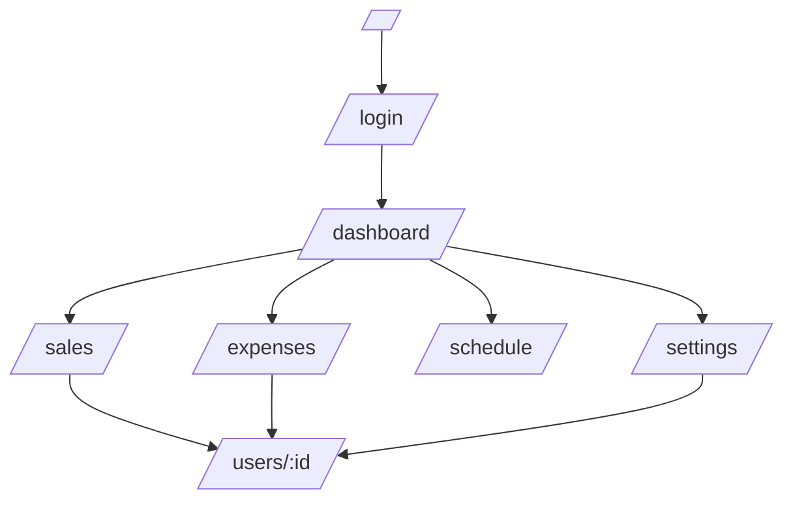

## 画面仕様（Screens）

参照実装:
- ルート: `sanhome-sales/src/app/**/page.tsx`
- ナビ: `sanhome-sales/src/components/Navigation.tsx`

---

## 1. 画面一覧

| 画面ID | パス | 名称 | 認証 | 権限 | 主な機能 |
|---|---|---|---|---|---|
| SCR-LOGIN | `/login` | ログイン | 不要 | - | 資格情報でログイン |
| SCR-DASH | `/dashboard` | ダッシュボード | 要 | sales/admin | 売上/粗利/経費集計、当日予定 |
| SCR-SALES | `/sales` | 売上管理 | 要 | sales/admin | 売上登録/削除、未決済、担当者/配分 |
| SCR-EXP | `/expenses` | 経費精算 | 要 | sales/admin | 月別一覧、画像アップロード、削除 |
| SCR-SCH | `/schedule` | スケジュール | 要 | sales/admin | 週/日表示、追加/編集/削除 |
| SCR-SET | `/settings` | 設定 | 要 | admin | ユーザー作成、グループ管理、所属設定 |
| SCR-USER | `/users/:id` | ユーザー詳細 | 要 | *要検討* | 個人別の経費/売上/予定、パスワード変更 |

補足:
- ナビの「設定」は管理者のみ表示（`isAdminOnly`）。
- 現状の実装では、`/users/:id` へのアクセス制御は画面側に明確なガードがなく、API側も制限が弱い（仕様上の要決定事項）。

---

## 2. 画面遷移（概要）

---

## 3. 画面別仕様（要点）

### 3.1 SCR-LOGIN（`/login`）
参照: `src/app/login/page.tsx`

- **入力**: メールアドレス、パスワード（minLength 6）
- **処理**: Server Action `authenticate` → NextAuth Credentials
- **エラー表示**: 認証失敗時にメッセージ表示

### 3.2 SCR-DASH（`/dashboard`）
参照: `src/app/(app)/dashboard/page.tsx`

- **フィルタ**:
  - 表示: 月別/年別
  - 期間: `yyyy-MM` または `yyyy`
  - 担当者: `/api/users` から選択
- **集計**:
  - 売上合計: `/api/sales` の `salesAmount` 合計
  - 粗利合計: `/api/sales` の `grossProfit` 合計
  - 経費合計: `/api/expenses` の `amount` 合計
  - 本日の予定: `/api/schedules`（当日 00:00-23:59）

### 3.3 SCR-SALES（`/sales`）
参照: `src/app/(app)/sales/page.tsx`

- **カテゴリ**: `いい部屋ネット` / `仲介` / `事業利益`
- **タブ**:
  - 事業利益・仲介（main）
  - 賃貸（いい部屋）（chintai）
- **半期定義（UIロジック）**:
  - 4-9月: 当年 4/1〜9/30
  - 10-12月: 当年 10/1〜翌年 3/31
  - 1-3月: 前年 10/1〜当年 3/31
- **一覧**:
  - 期間はローカルフィルタ（取得した配列を日付で絞る）
  - 未決済のみ表示（`isSettled=false`）
- **登録**:
  - 担当者（複数選択）
  - 配分比率（%）入力（合計100%でない/未入力時は均等分割という説明表示）
  - 決済日（必須表示）
- **決済状況トグル**: `/api/sales/:id (PUT)` に `isSettled` を送る
- **削除**: `/api/sales/:id (DELETE)`

### 3.4 SCR-EXP（`/expenses`）
参照: `src/app/(app)/expenses/page.tsx`

- **月フィルタ**: `yyyy-MM`（`/api/expenses?month=...`）
- **領収書画像**:
  - drag & drop / クリック選択
  - `/api/upload` でアップロードし、返却URLを `receiptImageUrl` として保存
- **削除**: 自分のレコードのみ削除可能（UI・APIともに制限）

### 3.5 SCR-SCH（`/schedule`）
参照: `src/app/(app)/schedule/page.tsx`

- **表示モード**:
  - 全員（週）
  - 個人（週 + userフィルタ）
  - グループ（日 + groupフィルタ、グループ所属メンバー列）
- **期間取得**:
  - 週: 週開始(月曜)〜+6日（start/end をAPIに渡す）
  - 日: 当日 00:00-23:59
- **編集/削除**: 自分の予定のみ（UI・APIともに制限）

### 3.6 SCR-SET（`/settings`）
参照: `src/app/(app)/settings/page.tsx`

- **グループ管理**:
  - 追加: `/api/groups (POST)`
  - 削除: `/api/groups/:id (DELETE)`（削除時、ユーザーの `groupId` は NULL になる想定）
- **ユーザー作成**: `/api/users (POST)`
  - 初期パスワードの入力UIあり（デフォルト `password123`）
  - 権限: `sales` / `admin`
- **所属設定**: `/api/users/:id (PUT)` で `groupId` 更新

### 3.7 SCR-USER（`/users/:id`）
参照: `src/app/(app)/users/[id]/page.tsx`

- **表示**:
  - ユーザー情報、所属グループ、権限
  - 経費（月選択）
  - 売上（期間指定、粗利配分後の「自分の粗利」表示）
  - 週間スケジュール
- **パスワード変更**:
  - `/api/users/:id (PUT)` に `password` を送信
  - 表示上「アカウント設定」ブロックが常に出るため、仕様として「本人のみ/管理者のみ」等を明確化が必要

